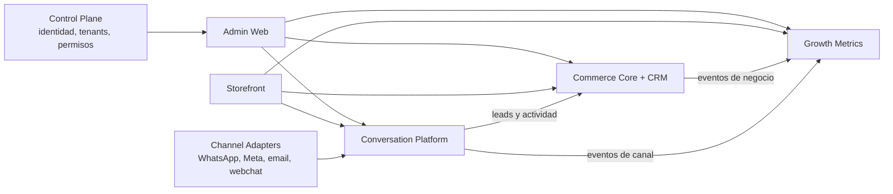

# Arquitectura objetivo de productos

Fecha: 2026-09-08

## Principio rector

La plataforma será un conjunto de soluciones independientes y reutilizables,
unificadas por identidad, navegación y contratos, bajo el modelo híbrido
aprobado en
`adr/ADR-009-HYBRID-TENANCY-AND-URUCORTINAS-PILOT.md`. El piloto usa data
planes dedicados; un producto solo puede ejecutar SaaS compartido después de
certificar su aislamiento tenant. Independencia significa poder versionar,
probar, desplegar y operar un producto sin modificar los internos de otro; no
exige repositorios separados desde el primer día.

## Productos objetivo

### 1. Commerce Suite — prioridad inmediata

Incluye:

- `commerce-core`: catálogo, precios, stock, checkout, órdenes, pagos,
  fulfillment y CRM;
- `admin-web`: operación interna, inicialmente shell compartido;
- `storefront-web`: experiencia pública reutilizable por tenant.

El backend y CRM permanecen juntos durante el cierre ecommerce porque hoy
comparten esquema, transacciones y flujo pedido-pago-cliente. Se evaluará
separar CRM después de estabilizar eventos y ownership.

### 2. Growth Metrics

Producto de conexión, ingestión, normalización y decisión para:

- GA4;
- Google Ads;
- Search Console;
- Meta Ads/Pixel/CAPI;
- conversiones propias de storefront, CRM y canales.

Primero será read-only y de recomendaciones. Las operaciones de campañas se
incorporarán después con permisos granulares, aprobación humana, dry-run,
idempotencia, auditoría y rollback. No se expondrán mutaciones de Ads como una
extensión incidental del conector de lectura.

### 3. Conversation Platform

`ai-platform` será el sistema de registro de conversaciones, estado, políticas
y ejecución IA. `channel-adapter` conservará la mecánica específica de cada
proveedor y traducirá a un mensaje canónico.

La evolución funcional será:

1. centralización y respuesta humana;
2. sugerencias IA visibles y aprobables;
3. automatización de casos acotados;
4. autonomía gradual medida por calidad, riesgo y canal.

El modelo conversacional duplicado en el backend principal se tratará como
legacy/puente. No se desarrollarán dos runtimes equivalentes.

### 4. Control Plane

Capacidad transversal futura para tenants, usuarios, permisos, suscripciones,
feature flags e inventario de integraciones. No debe convertirse ahora en un
proyecto grande: se extraerá desde contratos que ya necesitan los tres productos.

## Consecuencias de tenancy y deployment

| Producto | Clase inicial | Condición para ejecución compartida |
| --- | --- | --- |
| Commerce Core + CRM | Dedicado | Scope tenant completo en datos core, auth, jobs y storage, con pruebas negativas |
| Admin Web | Dedicado | Identidad y configuración runtime ligadas a tenant confiable, sin selección arbitraria del cliente |
| Storefront Web | Dedicado | Resolución por dominio/identidad confiable y eliminación de dependencia tenant en build/hardcodes |
| Growth Metrics | Dedicado en el piloto | Conexiones, credenciales, colas, eventos y reporting íntegramente tenant-scoped |
| Conversation Platform | Dedicado en el piloto | Configuración/secretos tenant-scoped, sin default productivo, más pruebas de fuga |
| Channel Adapters | Dedicado | Credenciales, sesiones, retries e idempotencia resueltos por tenant en cada mensaje |
| Control Plane | Futuro y fuera de alcance | Contrato y necesidad operativa demostrados por los productos |

El onboarding aprobado para UruCortinas es manual y auditable. Cada producto
provisiona únicamente los recursos que posee y valida `tenantId` en sus
fronteras; el detalle de aislamiento, deployment y onboarding está en ADR-009.

## Contratos compartidos

- `tenantId`, identidad y capacidades;
- eventos versionados (`order.created`, `payment.confirmed`, `lead.created`,
  `conversation.updated`, `conversion.recorded`);
- mensajes canónicos de canal;
- IDs externos e idempotency keys;
- errores y correlation/trace IDs;
- API pública con compatibilidad hacia atrás.

Los contratos pueden comenzar como schemas versionados en el monorepo. No se
creará un paquete `shared` generalista: cada elemento compartido necesita owner,
consumidores y política de versionado.

## Ownership de datos

| Dominio | Owner objetivo |
| --- | --- |
| catálogo, cliente, orden, pago, fulfillment | Commerce Core |
| conversación, mensaje, estado IA, channel binding | Conversation Platform |
| credenciales y métricas de fuentes, atribución, insights | Growth Metrics |
| credenciales del canal y transporte proveedor | Channel Adapters |
| tenant, usuario y capability global | Control Plane (gradual) |

## Ownership de configuración

- El tenant decide valores de negocio: marca, dominio, locale/moneda, catálogo,
  precios, políticas, cuentas de integración, contenido y capacidades elegidas
  dentro del catálogo permitido.
- La plataforma define y versiona schemas, defaults seguros, guardrails,
  compatibilidad y clases de deployment.
- El producto dueño de cada dato valida la configuración y custodia secretos;
  el tenant autoriza y puede revocar las credenciales aportadas.
- Las variantes `src/clients/<slug>` existentes son bootstrap/compatibilidad,
  no un control plane ni un almacén permitido de secretos.

## Decisión de migración

Se adopta un monolito modular con runtimes separables antes de crear nuevos
repositorios. Esta decisión reduce el riesgo de romper transacciones comerciales
y permite que las pruebas de contrato precedan a cada extracción física.
