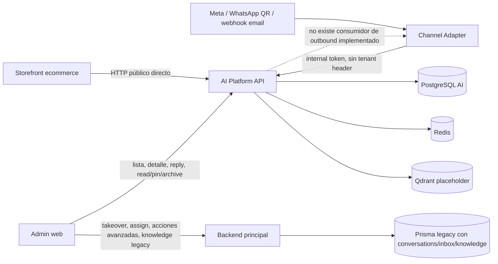
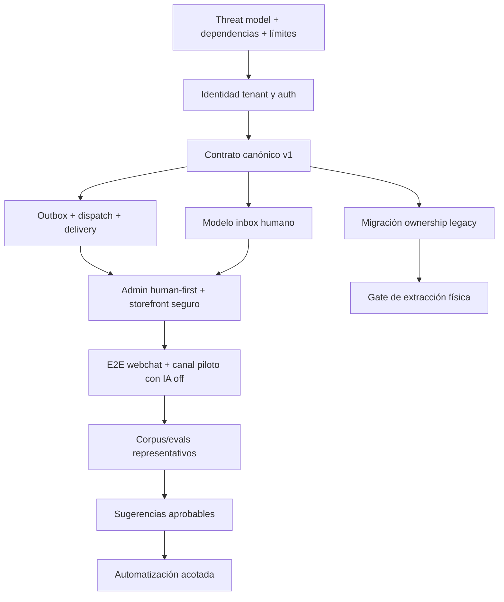

# Auditoría de estado actual — AI Platform y Channel Adapters

Fecha de corte: 2026-09-08
Tipo: auditoría de descubrimiento, solo lectura
Estado: baseline para consolidación de backlog; no autoriza implementación ni extracción física

## 1. Alcance, objetivo y criterio de evidencia

Esta auditoría cubre:

- `ai-platform/` completo: backend NestJS, frontend React/Vite, Prisma, documentos, tests y composición local;
- `services/channel-adapter/`: runtime, clientes, normalización y adaptadores Meta, WhatsApp QR, email y webchat;
- integración actual con `backend/`, `frontend/` y `ecommerce/`;
- ownership actual y objetivo de conversaciones, canales, conocimiento, catálogo, herramientas y datos;
- seguridad, multi-tenancy, observabilidad, modularización, mantenibilidad, pruebas y operación;
- secuencia obligatoria *human-first*: centralización operable y respuesta humana antes de sugerencias y automatización IA;
- condiciones para una separación futura en soluciones independientes pero unificadas.

Fuentes canónicas y reglas aplicadas:

- `AGENTS.md` y `ai-harness/AGENTS.md`;
- `docs/TARGET_PRODUCT_ARCHITECTURE.md`;
- `docs/MASTER_PLAN_2026-09-08.md`;
- `docs/GENERAL_AUDIT_2026-09-08.md`;
- `ai-harness/docs/backlog-contract.md`;
- `ai-harness/docs/extraction-gates.md`;
- código, esquemas, migraciones y pruebas del repositorio como evidencia primaria;
- `DEC-002`, `DEC-003` y `DEC-005` como decisiones rectoras: discovery antes de implementación, separación por contratos antes de repositorios y centralización humana antes de autonomía IA.

Convenciones usadas:

- **Implementado**: existe código actual para la capacidad.
- **Verificado localmente**: se ejecutó una comprobación determinista en esta auditoría.
- **No verificado en runtime real**: no se reprodujo contra servicios/proveedores reales con credenciales y tráfico controlado.
- **Bloqueante**: impide considerar el producto seguro, operable, multi-tenant o extraíble.

No se modificó código funcional. Los candidatos de backlog al final son `proposed`: deben incorporarse al backlog ejecutable, enlazarse a decisiones y superar el validador del harness antes de pasar a `ready`.

## 2. Conclusión ejecutiva

`ai-platform` no es un prototipo vacío: contiene un runtime conversacional relevante, persistencia propia, 18 migraciones, recursos gobernados, ingesta asíncrona, conocimiento documental, catálogo, trazas, test center, control de canales y dos superficies web. `channel-adapter` también contiene mecánica real para Meta y WhatsApp QR, además de normalización, backfill y operaciones específicas del proveedor.

Sin embargo, **el conjunto todavía no constituye una Conversation Platform operable ni publicable**. El principal riesgo no es la falta de volumen de código, sino que las fronteras críticas no cierran de extremo a extremo:

1. **Seguridad y aislamiento**: los endpoints administrativos de AI Platform están abiertos; `x-tenant-id` es aceptado desde el cliente sin identidad confiable; el webchat permite afirmar autenticación desde el navegador; existen tokens internos por defecto predecibles; hay ingress públicos sin firma; y los audits de producción reportan vulnerabilidades altas/críticas.
2. **Human-first incompleto**: las conversaciones pueden listarse y responderse en el admin, pero la respuesta se persiste como `pending_external` sin un enlace implementado hacia `/dispatch/meta` o `/dispatch/whatsapp-qr`. No hay asignación, takeover, release ni handoff canónicos en AI Platform. Además, el bridge devuelve siempre `controlMode: "ai"`, por lo que no existe todavía un modo operacional comprobable con IA deshabilitada.
3. **Tenant no transportado entre runtimes**: el adapter envía `tenantKey` en el body, pero no `x-tenant-id`; AI Platform obtiene el tenant real del header o de `DEFAULT_TENANT_ID`. Storefront tampoco envía el header. Esto puede guardar `tenantKey: urucortinas` como metadata mientras la fila pertenece a `demo-tenant`.
4. **Ownership duplicado**: el backend principal conserva modelos completos de conversaciones, handoff, tool calls, inbox y conocimiento, mientras AI Platform tiene equivalentes propios. El admin combina llamadas a ambas APIs. El catálogo conversacional también duplica al catálogo de Commerce.
5. **Canales dispares**: Meta tiene firma y sender; WhatsApp QR tiene amplia mecánica sobre Baileys; email es solo un bridge de webhooks, no transporte IMAP/SMTP; webchat está duplicado entre adapter y la fachada directa de AI Platform.
6. **QA no equivale a operación**: build y tests locales pasan, pero no se certificaron proveedores reales, entrega outbound, desconexión/reconexión, identidad multi-tenant, backup/restore ni failover. Una herramienta histórica de replay real está rota por un import eliminado.

Veredicto:

| Dimensión | Estado | Conclusión |
| --- | --- | --- |
| Arquitectura interna AI | avanzada | buenas separaciones conceptuales; todavía hay superficies abiertas y ownership externo duplicado |
| Inbox humano | parcial | lectura/estado personal básico; sin asignación/handoff ni entrega outbound cerrada |
| Sugerencias IA | no implementado en owner objetivo | el admin proyecta lista vacía; no hay lifecycle aprobable canónico |
| Automatización IA | prematura y parcialmente implícita | adapter invoca IA por defecto; no hay gates de autonomía, kill switch efectivo por conversación ni métricas de resultado |
| Multi-tenant | parcial y no seguro | muchas consultas se filtran, pero la identidad de tenant no es confiable ni consistente entre consumidores |
| Canales | desigual | Meta/WhatsApp QR con base técnica; email scaffold; webchat duplicado |
| Seguridad | bloqueante | auth ausente, fronteras públicas débiles y dependencias críticas/altas |
| Operación real | no certificada | no hay evidencia actual reproducida de proveedores, delivery, restore o release |
| Extracción física | no habilitada | no cumple owner único, contrato versionado, independencia, secretos, runbook ni release gate |

La ruta recomendada no es ampliar IA. Es: **cerrar seguridad y contratos → centralización humana operable con IA apagada → sugerencias aprobables → automatización acotada y medible**.

## 3. Topología real observada



Observaciones:

- Storefront usa `POST /chat/public/webchat/session`, `POST /chat/public/webchat/messages` y polling de sesión directamente contra AI Platform. No usa el adapter de webchat.
- El adapter ingiere mensajes y llama al turno IA interno; luego `replyAsAgent` solo persiste el texto en AI Platform. Los senders externos existen, pero no están conectados al mensaje persistido.
- El admin central migró operaciones básicas a AI Platform, pero conserva operaciones avanzadas contra rutas `/conversations/*` del backend principal. No se encontró implementación actual equivalente en `backend/src`; deben considerarse no verificadas y potencialmente rotas.
- `deploy/docker-compose.channel-adapter.yml` levanta adapter y Redis, depende del backend principal y apunta a un AI Platform externo en el host. El compose standalone de `ai-platform/` no incluye el adapter. La topología de desarrollo requiere coordinación manual entre dos composiciones.

## 4. Estado de AI Platform

### 4.1 Componentes y responsabilidades actuales

El backend tiene 28 módulos/carpetas de primer nivel. La separación principal es coherente con el diseño objetivo:

| Área | Responsabilidad actual | Evaluación |
| --- | --- | --- |
| `ai-gateway` | ensamblado de prompts, registry de proveedores, OpenAI/mock, interpretación y generación estructurada | frontera útil; provider real no se verificó en esta auditoría |
| `interpretation` + `parsing` | intent/entities por IA y normalización determinista de fechas/medidas | implementado y probado |
| `decision` | selección backend-owned de responder, aclarar o invocar tool | alineado con no delegar decisiones al modelo |
| `tools` | `create_booking`, `create_quote`, `get_product` | booking/quote son stubs sintéticos; producto consulta catálogo propio de AI Platform |
| `continuity` + `conversation-signals` | estado, threading, follow-up, cierre y señales | amplia cobertura unitaria; lógica compleja aún muy acoplada al runtime |
| `response` + `response-fallback` | contexto aprobado, grounding, redacción y guardrails | buena separación conceptual; falta evaluación operacional representativa |
| `documents` | carga, extracción, chunks, claims, proposiciones, promoción y retrieval | capacidad sustancial; upload/security/retention no cerrados |
| `knowledge` + `knowledge-metadata` | aprendizaje desde logs y catálogo administrable de conocimiento aprendido | queue en memoria y embeddings placeholder; no es retrieval documental principal |
| `catalog` | fuentes upload/REST e items propios | duplica verdad de productos de Commerce mientras no exista contrato |
| `runtime-resources` + `critical-config` + `prompt` + `temporal` | versiones DRAFT/ACTIVE/ARCHIVED por tenant | base de gobernanza valiosa |
| `channel-control` | desired state, secretos/referencias, observed connection state y comandos al adapter | separación desired/observed correcta; admin abierto y secretos locales inseguros |
| `api` | chat síncrono, async, webchat público, admin, test center y bridge interno | demasiadas superficies con modelos de seguridad distintos aún no implementados |
| `persistence` | Prisma, repositorios, contexto tenant y trazas | estructura propia; enforcement tenant dual/incompleto |
| `security` | cifrado de secure config y plan de auth futuro | `SecurityModule` no implementa auth/roles; documentación lo reconoce como preparación |
| `infrastructure` | health/readiness para DB, Redis, Qdrant y runtime IA | readiness profundo existe, pero Docker usa el health superficial |

### 4.2 Pipeline conversacional

El flujo canónico implementado es:

1. persistencia/recepción del input;
2. interpretación IA con esquema validado;
3. parsing determinista;
4. retrieval documental opcional;
5. decisión backend-owned;
6. ejecución de tool aprobada;
7. generación o fallback sobre contexto aprobado;
8. persistencia de respuesta y logs;
9. aprendizaje asíncrono desde los logs.

Fortalezas:

- el modelo no selecciona directamente el tool ni controla la ejecución;
- las respuestas usan contratos Zod y guardrails;
- los prompts y configuraciones críticas tienen lifecycle versionado;
- las trazas persisten etapas, estado, latencia y decisiones;
- la ingesta async persiste turns e inputs y recupera timers de estados estabilizando/en espera después de reinicio.

Limitaciones relevantes:

- `create_booking` genera un ID aleatorio y devuelve `status: confirmed` sin crear una reserva real;
- `create_quote` calcula un valor sintético fijo y devuelve USD sin integrar Commerce/CRM;
- el catálogo consultado pertenece a AI Platform y no al dueño objetivo de catálogo/precio/stock;
- una interrupción durante `PROCESSING` se marca `recovery_interrupted` y requiere un nuevo mensaje; no hay worker durable con retry;
- los timers, typing signals y la cola de aprendizaje están en memoria del proceso;
- el runtime de canales externo vuelve a coalescer y temporizar mensajes, duplicando responsabilidad con la ingesta async interna;
- la arquitectura actual puede presentar resultados sintéticos como acciones confirmadas, lo que no es aceptable para operación real.

### 4.3 Knowledge y documentos

Existen tres familias que conviene mantener separadas:

1. **Documentos gobernados**: `DocumentRecord`, chunks, claims, proposiciones y estados de promoción. Son la fuente actual de retrieval conversacional.
2. **Conocimiento aprendido**: se deriva de etapas `execution` y `response`; por defecto `LEARNING_ENABLED` es `true`. Guarda patrones/resultados de logs en `Knowledge`.
3. **Catálogo estructurado**: fuentes upload/REST e items propios usados por `get_product`.

Hallazgos:

- Qdrant solo recibe vectores deterministas de 16 dimensiones derivados de SHA-256; no hay embedding semántico real ni búsqueda Qdrant conectada al retrieval documental.
- El health de Qdrant es requerido para readiness aunque su índice no sea el motor de retrieval principal.
- La cola de learning es un array en memoria sin persistencia, retry, DLQ ni backpressure.
- Learning puede guardar cuerpos que incluyen outputs de tools o fragmentos de respuesta. No se encontró política integral de PII, consentimiento, retención o borrado.
- Existe una allowlist de metadata, pero no una anonimización equivalente del cuerpo aprendido.
- El backend legacy mantiene un dominio de knowledge mucho más grande y el admin continúa consumiendo rutas `/ai/knowledge/*`; no existe aún inventario de migración con owner único y compatibilidad.
- El corpus real bajo `.qa/` está ignorado por Git; se localizaron 500 archivos locales, mientras solo cinco fixtures destilados están versionados. Esto evita versionar datos sensibles por defecto, pero impide reproducir el corpus real sin un proceso seguro de snapshot/anonymization/versioning.

### 4.4 Evals y test center

Implementado:

- 17 escenarios curados en español, mayormente específicos del negocio Urucortinas;
- replay multi-turn y persistencia de evaluaciones por conversación/turno;
- métricas de correctitud, coherencia, fluidez, redacción y overall;
- comparación de trazas y visualización desde el frontend standalone.

Límites:

- la evaluación es heurística/determinista basada en términos, patrones y forma; no es evaluación independiente por modelo ni medición con outcome humano;
- no cubre entrega de canal, intervención humana, precisión de identidad, seguridad ni impacto comercial;
- no hay umbrales de calidad/costo/latencia que bloqueen release;
- los escenarios no representan múltiples tenants/idiomas/canales de forma suficiente;
- la herramienta `tools/qa/replay-real-corpus-run.mjs` falla al iniciar porque importa `services/channel-adapter/src/clients/backend-conversations.client.js`, archivo que ya no existe;
- `tools/qa/use-cases-report.source.mjs` califica como verificada una respuesta manual WhatsApp cuando su aceptación habla de persistencia/traza, no de entrega real al proveedor. Esa evidencia no debe usarse como gate outbound.

Conclusión: el test center es una buena base de diagnóstico, no un gate de autonomía.

### 4.5 Frontend standalone de AI Platform

Capacidades:

- shell admin para recursos, documentos, conocimiento, test center y canales;
- shell público `/chat` sobre endpoints async;
- selección de tenant por `VITE_TENANT_ID` y header `x-tenant-id`.

Riesgos/deuda:

- no existe script de test para el frontend; solo build;
- el navegador controla el tenant y no envía identidad/rol verificable;
- el chat público async lista conversaciones recientes del tenant y obtiene sesiones por ID sin una identidad de guest; es una superficie exploratoria, no un widget público seguro;
- admin y chat público comparten bundle/aplicación y distinguen modo por pathname;
- `frontend/public` contiene aproximadamente 92 MB y 1.601 assets DreamsChat vendorizados; deben inventariarse antes de limpiar, no borrarse por volumen;
- `ai-platform/docs/architecture.md` declara primero Wave 8.2 como próxima y luego como cerrada, mientras mantiene seguridad en Wave 9. `docs/progress.md` es un log append-only extenso. La verdad de producto no está condensada en un estado canónico único.

## 5. Estado de Channel Adapter

### 5.1 Runtime y contrato general

Es un servidor HTTP ESM de Node, sin framework, con:

- health y listado de canales;
- rutas de configuración/operación internas;
- webhooks públicos;
- dispatch de Meta y WhatsApp QR;
- clientes HTTP hacia AI Platform;
- mensaje unificado y sanitización básica;
- coalescing de utterances antes del turno IA.

La regla de `services/README.md` —sin acceso directo a PostgreSQL y AI Platform como owner— se cumple. No obstante, hay un import directo hacia `services/shared/tenant-policy`, no declarado como dependencia del paquete. El Dockerfile copia `shared` fuera del árbol del adapter para hacerlo funcionar. Esto viola el gate de no imports entre productos y acopla timing de canal con vocabulario de tenants concretos.

Aunque declara `ioredis` y `REDIS_URL`, no se encontró uso activo de Redis en `src/`. Coalescing, límites y estado temporal son process-local.

### 5.2 Matriz de canales

| Canal | Inbound | Outbound | Seguridad ingress | Estado real |
| --- | --- | --- | --- | --- |
| Storefront webchat directo | AI Platform recibe sesión/mensaje y ejecuta async | respuesta aparece por polling | guest ID débil y auth client-controlled | implementado localmente; no seguro para producción |
| Adapter webchat | webhook normaliza y reenvía a la misma fachada pública | solo persiste respuesta en AI Platform | endpoint público sin firma/token | duplicado/legacy; storefront no lo usa |
| Meta Messenger/Instagram | verificación challenge, HMAC, normalización, idempotencia parcial | sender con retry y `/dispatch/meta` | firma Meta implementada | piezas presentes; flujo persistencia→dispatch no conectado ni sandbox verificado |
| WhatsApp QR/Baileys | socket, QR, reconexión, history/backfill, attachments y acciones | `/dispatch/whatsapp-qr`, typing/presence/delay/limits | sesión local; librería no oficial con advisories críticos | capacidad amplia pero alto riesgo operativo/seguridad; no certificada |
| Email | acepta payload/status por webhook y normaliza | no existe `/dispatch/email`, SMTP sender ni poller IMAP | ingress público sin firma/token | scaffold de integración externa, no canal email operable |

### 5.3 Flujo outbound faltante

Meta y WhatsApp QR tienen métodos `sendOutbound`, pero ningún componente de AI Platform consume los mensajes `pending_external` para invocar los endpoints de dispatch. Tanto la respuesta IA del adapter como la respuesta manual del admin llaman a `replyAsAgent`, que:

- agrega un `Message` ASSISTANT;
- crea/actualiza `ChannelMessageRecord` con `status: pending_external`;
- no llama al adapter;
- no implementa outbox, lease, retry, idempotency key o DLQ.

Consecuencias:

- una respuesta puede verse en el admin y no haber salido al canal;
- el sistema puede reportar éxito de UI sin delivery real;
- no hay reconciliación segura entre ID interno y provider message ID;
- `syncOutboundStatus` intenta actualizar `Message` usando `remoteId`; después de un dispatch real ese valor normalmente sería ID del proveedor, no el ID interno, salvo que se defina un mapping explícito;
- WhatsApp procesa `messages.update` en su store local, pero no sincroniza allí el estado hacia AI Platform.

### 5.4 WhatsApp QR

`whatsapp-qr.adapter.js` tiene 2.580 líneas y mezcla:

- config y control plane;
- lifecycle de socket;
- credenciales y persistencia local;
- caches de chats/contactos/grupos;
- backfill;
- ingesta y llamadas IA;
- dispatch y acciones sobre mensajes;
- rate limits, quiet hours, presence y delays;
- descarga de media.

Riesgos:

- credenciales de `useMultiFileAuthState`, config y store se escriben en archivos locales sin cifrado, locking ni escritura atómica;
- el store conserva hasta miles de mensajes y metadata; no hay política de retención o backup/restore ensayado;
- logger Pino está en `silent`; varios errores son absorbidos con `catch(() => undefined)` o `catch {}`;
- límites outbound viven en memoria y se reinician al reiniciar el proceso;
- quiet hours usan hora local del proceso, no timezone tenant;
- el proceso es esencialmente single-instance; dos réplicas podrían dividir/co-duplicar eventos y corromper estado local;
- Baileys es una integración no oficial y la versión instalada tiene advisories críticos.

### 5.5 Coalescing y cancelación

`PendingUtteranceAssembler` es el mecanismo activo; `InboundTurnCoalescer` queda como implementación anterior/redundante.

- usa Maps y timers en memoria;
- perdería pending turns al reinicio;
- marcar `evaluation.canceled` evita proyectar el resultado, pero el cliente AI ignora el segundo argumento y no pasa `AbortSignal` al fetch; la llamada remota continúa consumiendo recursos;
- el cálculo contiene regex en español y vocabulario tenant específico de `services/shared/tenant-policy`;
- AI Platform ya implementa ingesta async, timing y cancelación persistida.

La decisión de cierre semántico del turno debe tener un solo owner. El adapter debería entregar eventos canónicos y mecánica del proveedor; la estabilización semántica debe residir en Conversation Platform.

## 6. Integraciones con productos existentes

### 6.1 Backend principal

El esquema Prisma legacy conserva ownership solapado:

- `Conversation`, `ConversationMessage`, `ConversationParticipant`, `ConversationReadState`, `ConversationHandoffEvent`, `ConversationToolCall` y external identities;
- `InboxAccount`, `InboxMessage`, attachments, sync state, queues y asignaciones;
- un conjunto grande de `Knowledge*`;
- email settings/templates/logs;
- `backend/src/ai/ai.service.ts` (3.757 líneas) y `backend/src/knowledge/knowledge.service.ts` (11.563 líneas).

AI Platform tiene sus propias conversaciones, mensajes, estado, bindings, channel records, operator state, documentos y knowledge. Esto es duplicación de modelo, no separación consolidada.

El target ya define que AI Platform debe ser el owner. El backend legacy solo puede ser anti-corruption bridge temporal, con:

- contrato versionado;
- migración y reconciliación documentada;
- prohibición de dual-write no gobernado;
- métricas de tráfico restante;
- fecha/criterio de retiro.

No debe extraerse físicamente ninguno de los dos mientras esta transición no tenga owner y gates.

### 6.2 Admin frontend

`ConversationsService.ts` combina AI Platform y backend principal:

- AI Platform: listar, detalle, responder, read/unread, pin/unpin, archive, mute, delete/restore;
- backend legacy: takeover/release/assign/reroute, reacciones, quote-reply, editar/borrar/star/forward/media, feedback de sugerencias, debug y creación de conversaciones.

La proyección de AI Platform entrega actualmente:

- `controlMode: ai` siempre;
- `needsHuman: false` siempre;
- `assignedToUser: null`;
- `handoffEvents: []`, `toolCalls: []`, `aiSuggestions.items: []`;
- customer/CRM sin resolver;
- scope generalizado como `customer_public`.

El frontend reconstruye inboxes, queues, contactos, filtros y paginación leyendo hasta 500 conversaciones y procesándolas en el navegador. No es una API operacional escalable ni consistente.

Deuda estructural medible:

- `frontend/src/services/ConversationsService.ts`: 1.784 líneas;
- `frontend/src/views/crm/ConversationsV2/ConversationsV2.tsx`: 7.520 líneas;
- `frontend/src/views/crm/Conversations/Conversations.tsx`: 2.066 líneas;
- `frontend/src/services/AiKnowledgeService.ts`: 1.186 líneas;
- `frontend/src/views/settings/AiKnowledgeDocuments/index.tsx`: 1.965 líneas.

El cliente Axios añade el bearer del backend y `X-Correlation-Id` aun para URLs absolutas de AI Platform. AI Platform no valida ese bearer y espera `x-trace-id`; tampoco se añade `x-tenant-id`. Hay apariencia de auth/tracing sin enforcement ni continuidad reales.

### 6.3 Storefront

Aspectos positivos:

- integración directa con el owner objetivo;
- sesión guest persistida y polling de respuesta;
- tests E2E presentes para webchat guest/authenticated y memoria.

Bloqueos:

- `tenantKey` está hardcodeado como `urucortinas`;
- el request no envía `x-tenant-id` ni una aserción firmada desde Commerce;
- `authenticated` y `scope` se derivan en el cliente y son aceptados por AI Platform;
- AI Platform no valida el token de sesión Commerce, `customerId` ni pertenencia;
- `GET /session/:conversationId` permite omitir `guestId`;
- la sesión/transcript y guest ID se guardan en `localStorage`;
- el cliente limita attachments, pero el DTO de servidor no limita cantidad/tamaño de `content`, `textContent` o metadata;
- mensajes y adjuntos pueden quedar guardados como JSON/data URLs en PostgreSQL;
- `controlMode` y `needsHuman` no reflejan un workflow humano real.

## 7. Datos, Prisma y multi-tenancy

### 7.1 Esquema propio

AI Platform tiene 28 modelos Prisma; 27 incluyen `tenantId` y `SecureConfig` es global. Hay 18 migraciones versionadas y `prisma validate` pasa.

Familias principales:

- conversación: Conversation, Message, State, async turns/inputs;
- operador/canal: OperatorState, Binding, MessageRecord, PublicWebchatSession;
- gobernanza: Prompt, Temporal, CriticalConfig, KnowledgeMetadata, ResponseFallback;
- canal: ConnectionState y ChannelSecret;
- documentos/knowledge/catalog;
- test center/evaluations.

### 7.2 Enforcement tenant

Hay dos mecanismos simultáneos:

1. middleware Prisma automático para 14 modelos;
2. filtros manuales por tenant en repositorios de otros modelos.

Trece modelos tenant no están en `TENANT_MODELS`: OperatorState, bindings, channel records, public sessions, critical config, connection state, channel secrets, knowledge metadata, response fallbacks, catalog sources/items y evaluaciones. Varios repositorios agregan correctamente el filtro, pero el invariant depende de disciplina local y casts `as any`, no de una garantía completa.

El problema mayor está antes de Prisma:

- `TenantMiddleware` confía en `x-tenant-id` o cae a `DEFAULT_TENANT_ID`;
- no deriva tenant de usuario/token ni valida membership;
- clientes internos del adapter no envían ese header;
- storefront envía `tenantKey` en body, que solo se guarda en metadata;
- el frontend standalone sí envía `VITE_TENANT_ID`, pero el navegador puede cambiarlo.

Por tanto, hay scoping de queries, pero no una frontera multi-tenant autenticada.

### 7.3 Secretos y configuración

- `SecureConfig` cifra con AES-256-GCM y exige `CONFIG_ENCRYPTION_KEY`, pero es global; debe decidirse si la credencial de modelo es plataforma o tenant.
- `ChannelSecret` es tenant-scoped pero almacena `value` en texto plano. La estrategia `local` está documentada para local/dev, pero los endpoints que la administran están abiertos.
- El adapter guarda credenciales WhatsApp QR en filesystem sin cifrado.
- AI Platform y adapter aceptan `local-ai-internal-token` como fallback. También aparece en ejemplos y E2E.
- La documentación recomienda schema PostgreSQL `ai_platform`, pero compose y `.env.example` usan `schema=public`. En una DB dedicada no comparte datos, pero la contradicción debe resolverse antes de migrar/extraer.

## 8. Seguridad

### 8.1 Hallazgos bloqueantes de AI Platform

1. No hay `UseGuards` ni auth efectiva en admin, settings, logs, documentos, catálogo, knowledge, prompts, test center o conversaciones.
2. El bearer del admin no se valida; `SecurityModule` solo prepara un plan futuro.
3. El tenant se acepta desde header controlado por el caller.
4. Webchat confía en booleanos client-side para `customer_authenticated`.
5. La lectura de sesión no exige siempre guest ID.
6. `/chat/async/conversations` y sesiones async exponen superficies tenant-wide no apropiadas para público.
7. CORS permite `origin.endsWith(allowed)`, comparación insegura para dominios con sufijos engañosos; además acepta `*` si se configura.
8. No hay rate limit, security headers, límites globales de body ni cuotas por tenant.
9. Attachments y metadata no tienen límites server-side suficientes.
10. Uploads/document parsing conviven con vulnerabilidades DoS en ZIP/multipart.
11. Logs y learning pueden persistir contenido sensible sin retención/anonymization integral.
12. El token interno por defecto es predecible y no transporta identidad, scope, replay protection ni tenant.

### 8.2 Hallazgos bloqueantes del adapter

1. `/webhooks/webchat`, `/webhooks/email` y `/webhooks/email/status` son públicos sin firma/token.
2. `readRawBody` acumula el body completo sin límite.
3. CORS es `*` para todas las respuestas, incluso rutas internas.
4. Errores internos se devuelven al caller con `error.message`.
5. No hay rate limiting, timeout de body, concurrency limit ni protección contra replay.
6. Meta sí valida HMAC, pero la idempotencia inbound es check-then-insert sin transacción; dos eventos concurrentes podrían persistir dos mensajes antes del unique upsert.
7. No hay idempotencia durable outbound.
8. El adapter es single-tenant por proceso implícitamente (`CLIENT_SLUG`), sin contrato/topología explícita.
9. WhatsApp QR persiste credenciales y mensajes en claro.
10. Los límites outbound se reinician con el proceso.

### 8.3 Dependencias de producción

Resultados reproducidos con `npm audit --omit=dev --json`:

| Producto | Critical | High | Moderate | Low | Total |
| --- | ---: | ---: | ---: | ---: | ---: |
| AI Platform | 0 | 6 | 7 | 1 | 14 |
| Channel Adapter | 2 | 3 | 1 | 0 | 6 |

AI Platform incluye riesgo alto en `@nestjs/platform-express`/Multer, `adm-zip`, lodash, form-data y undici. Es especialmente relevante porque procesa uploads y datos externos.

Channel Adapter incluye:

- Baileys rc.9: advisory crítico de spoofing/history sync/app-state corruption; el fix indicado comienza en rc.12;
- `protobufjs`: advisories críticos/altos de ejecución o inyección/DoS;
- `sharp` y `ws`: high;
- `@whiskeysockets/libsignal-node`: high.

El adapter consume tráfico hostil de proveedores; estas vulnerabilidades bloquean cualquier piloto conectado.

## 9. Observabilidad y operación

Capacidades presentes:

- `x-trace-id` en AI Platform y ChatLog por etapa;
- latencia/estado de pipeline y trazas comparables;
- readiness de PostgreSQL, Redis, Qdrant y runtime IA;
- desired state y observed state de canales;
- últimos estados/errores de conexión WhatsApp QR;
- eventos de delivery Meta/email pueden sincronizarse si llegan al endpoint correspondiente.

Brechas:

- el admin usa `X-Correlation-Id`, no `x-trace-id`; el adapter no propaga trace ni tenant;
- no hay OpenTelemetry, métricas Prometheus, dashboards, SLO, alertas, error budget o costo por tenant/canal;
- el health Docker de AI Platform consulta `/health`, que siempre devuelve `ok`, no `/health/ready`;
- el health del adapter siempre devuelve `ok` sin evaluar AI Platform, proveedor, storage o estado de sesión;
- Pino de WhatsApp está silenciado y hay errores absorbidos;
- no hay outbox metrics, retry queue, DLQ ni reconciliación de mensajes estancados;
- no se encontró runbook de incidentes, backup/restore o rollback específico de AI Platform/adapter;
- el compose del adapter no arranca AI Platform y mantiene una dependencia obsoleta del backend principal;
- no hay prueba de dos réplicas, pérdida de Redis/Qdrant/Postgres, corte de proveedor o rotación de secretos.

## 10. Verificación realizada

| Verificación | Resultado | Alcance real |
| --- | --- | --- |
| `ai-platform npm run build` | pasa | TypeScript backend y Vite frontend; bundle JS principal ~326,81 kB |
| `ai-platform npm test -- --silent` | 91/91 suites, 454/454 tests | unit/architecture con mocks; no certifica stack/proveedor |
| `prisma validate` | pasa | esquema sintácticamente válido |
| `channel-adapter npm test` | 36/36 tests | unidades de Meta, WhatsApp QR, webchat, coalescing y normalización |
| `channel-adapter test:coverage` | pasa; 65,86% lines / 49,43% branches | no carga `main.js`, clientes ni email; no hay threshold, por lo que el porcentaje agregado es incompleto |
| audit prod AI Platform | 14 vulnerabilidades | release bloqueado por highs aplicables |
| audit prod adapter | 6 vulnerabilidades | release bloqueado por 2 critical y 3 high |
| replay real corpus | falla al cargar | import hacia cliente eliminado |

No se ejecutó ni se declara verificado:

- stack Docker completo coordinado;
- `/health/ready` contra servicios reales;
- OpenAI real actual, costos/latencia/fallback;
- Meta sandbox/webhook real/send API;
- WhatsApp QR real, desconexión, rotación/relogin, delivery receipts;
- IMAP/SMTP real;
- respuesta humana admin → proveedor → receipt;
- aislamiento negativo entre dos tenants autenticados;
- backup/restore/rollback;
- E2E storefront/admin conectados al stack actual.

`ai-platform/docs/architecture.md` registra smokes históricos con OpenAI. Se consideran evidencia histórica, no certificación de este corte, porque no se reprodujeron y la documentación tiene estados de wave contradictorios.

## 11. Modularización, limpieza y ownership

### 11.1 Limpieza prioritaria con valor observable

No conviene iniciar un refactor general. Los cortes deben responder a contratos y aceptación:

1. separar transporte HTTP/router del adapter para poder probar seguridad y límites;
2. dividir WhatsApp QR por session, store, inbound, outbound, history y operations;
3. retirar coalescing duplicado después de fijar a AI Platform como owner;
4. dividir `ConversationsService` en cliente AI, legacy bridge y mappers; luego eliminar el bridge por migración;
5. dividir `ConversationsV2` por inbox list, detail, composer, channel actions y operator state;
6. aislar legacy knowledge/AI detrás de un anti-corruption layer y plan de migración;
7. inventariar assets DreamsChat por uso/bundle antes de retirar copias;
8. condensar docs canónicos y archivar estados de wave sin perder historia.

### 11.2 Matriz de ownership

| Dominio | Owner objetivo | Estado actual | Acción requerida |
| --- | --- | --- | --- |
| conversación/mensaje/estado IA | AI Platform | duplicado con backend legacy | migración y retiro gradual |
| estado operador/asignación/handoff | AI Platform | legacy más operator state parcial | completar modelo human-first |
| transporte y credenciales proveedor | Channel Adapter | parcialmente en AI Platform/local FS/legacy email | separar secret control y mechanics |
| catálogo/precio/stock | Commerce Core | catálogo duplicado en AI Platform | API/event contract, sin dual truth |
| cliente/lead | Commerce/CRM | AI projection sin customer | anti-corruption contract |
| knowledge conversacional | AI Platform | duplicado con backend legacy | inventario, clasificación y migración |
| auth/tenant/roles | Control Plane gradual | headers/defaults dispersos | identidad confiable común |
| email transaccional ecommerce | Commerce/notifications | correctamente separado conceptualmente | no mezclar con inbox email |

### 11.3 Gate de extracción

| Gate obligatorio | AI Platform | Channel Adapter |
| --- | --- | --- |
| owner único de datos/comportamiento | no: legacy conversations/knowledge/catalog duplicados | parcial: transport sí, coalescing/AI no |
| contrato versionado y errores | no | no |
| sin imports directos entre productos | parcial | no: importa `services/shared/tenant-policy` |
| config y secretos propios | parcial/inseguro | parcial/inseguro |
| migraciones + backup/restore/rollback | migraciones sí; restore/rollback no ensayados | filesystem sin procedimiento |
| observabilidad + health + runbook | parcial | insuficiente |
| release y compatibilidad verdes | no: security/E2E faltan | no: advisories y proveedores faltan |
| despliegue independiente | compose propio parcial | imagen/overlay propio parcial; topología depende de host |

Conclusión: **no extraer físicamente todavía**. Primero frontera lógica, contrato versionado, runtime independiente, datos/secretos operables y release gate. Recién luego corresponde extracción Git.

## 12. Ruta human-first obligatoria

### Gate 0 — Seguridad e identidad

Salida mínima:

- auth de admin y servicio-a-servicio;
- tenant derivado y validado;
- public webchat con identidad guest/customer segura;
- dependencias críticas/altas remediadas o excepción fechada;
- límites de payload/upload y webhooks firmados.

### Hito H1 — Centralización humana operable con IA apagada

Flujo de aceptación:

```text
mensaje real de webchat o canal piloto
→ normalización canónica e idempotente
→ conversación visible en inbox
→ asignación/takeover por operador autenticado
→ respuesta humana
→ outbox durable
→ dispatch al proveedor
→ sent/delivered/read o failed/retry visible
→ trazabilidad correlacionada de extremo a extremo
```

Condiciones:

- `controlMode: human` como modo disponible y verificable;
- IA completamente deshabilitable por tenant/canal/conversación;
- webchat más un canal externo como piloto, no todos simultáneamente;
- attachments, unread, assignment, handoff, retries y estados de delivery;
- CRM link por contrato, sin leer Prisma de Commerce;
- E2E real y pruebas de desconexión/reconexión.

### Hito H2 — Sugerencias IA aprobables

Solo después de H1:

- suggestion lifecycle explícito: generated → shown → accepted/edited/rejected/expired;
- nunca dispatch automático;
- evidencia de source/grounding, latencia y costo;
- dataset anonimizado y evals por tenant/canal;
- feedback humano como dato de evaluación, no auto-learning sin revisión.

### Hito H3 — Automatización acotada

Solo después de superar umbrales de H2:

- intents de bajo riesgo y tools idempotentes reales;
- capability gates por tenant/canal;
- límites de volumen/costo, kill switch y fallback humano;
- auditoría de cada acción y outcome;
- rollout gradual y rollback probado.

## 13. Decisiones requeridas antes de implementar

1. Canal externo piloto: Meta Messenger/Instagram o WhatsApp QR. Webchat debe acompañarlo como baseline.
2. Aceptación de riesgo de Baileys/no oficial o migración a una integración oficial para WhatsApp.
3. Topología tenant del adapter: proceso por tenant o worker multi-tenant con credenciales/particiones explícitas.
4. Identidad común: issuer, claims, roles y mapping tenant para admin, storefront e internos.
5. Owner de catálogo conversacional: Commerce API/eventos versus replica read-model en AI Platform.
6. Destino del knowledge legacy: migrar, archivar o mantener como fuente externa con contrato.
7. Alcance email: transporte propio IMAP/SMTP o webhook firmado de un proveedor/servicio externo.
8. Política de attachments: tipos, tamaño, malware scan, storage, TTL, descarga y borrado.
9. Política de datos IA: proveedor, residencia, PII, consentimiento, retención, training opt-out y borrado.
10. Semántica del inbox humano: roles, queues, asignación, SLA, takeover, handoff y permisos por acción.
11. Credencial de modelo global versus por tenant y su billing/costo.
12. Database/schema target y procedimiento de backup/restore/rollback.

## 14. Dependencias recomendadas del backlog



## 15. Candidatos de backlog — AI Platform

Todos los candidatos permanecen `proposed` hasta resolver decisiones, registrarlos en `planning/backlog.json`, agregar `decisionRefs` y validar el harness.

### AI-001 — Threat model y clasificación de datos

- **Objetivo**: documentar activos, actores, trust boundaries y abuso para admin, webchat, uploads, IA, canales, secretos y datos personales.
- **Alcance**: DFD, STRIDE/abuse cases, clasificación de datos, retención, riesgos de prompt injection y priorización P0/P1.
- **Fuera de alcance**: implementar controles o cambiar proveedores.
- **Dependencias**: decisiones 4, 8, 9 y 11 de esta auditoría.
- **Aceptación**: cada endpoint y flujo tiene actor, credencial, tenant source, datos, amenazas, control requerido y riesgo residual; owner humano aprueba.
- **Verificación**: revisión security/product; checklist trazable a AI-002..AI-006 y CH-002; `npm run harness:backlog -- --id AI-001`.

### AI-002 — Contrato de identidad, roles y tenant

- **Objetivo**: definir cómo Control Plane/Commerce autentican usuarios y servicios y cómo AI Platform deriva `tenantId`.
- **Alcance**: issuer/audience, claims, roles, service identity, tenant membership, actor ID, trace ID y rechazo de headers no confiables.
- **Fuera de alcance**: UI de usuarios o facturación.
- **Dependencias**: AI-001; decisión humana sobre issuer/control plane.
- **Aceptación**: contrato versionado con ejemplos positivos/negativos para admin, storefront e internos; no usa `DEFAULT_TENANT_ID` en producción.
- **Verificación**: schema/contract tests planificados; threat review; compatibilidad documentada para consumidores.

### AI-003 — Enforcement auth/RBAC en superficies administrativas

- **Objetivo**: proteger admin, settings, logs, prompts, documents, knowledge, catalog, test center y channel control.
- **Alcance**: guards, permisos de lectura/mutación/secrets, actor auditado y CORS exacto.
- **Fuera de alcance**: rediseño visual y auth pública.
- **Dependencias**: AI-002.
- **Aceptación**: 401 sin credencial, 403 sin rol, aislamiento entre tenants, actor real en mutaciones; ningún endpoint admin abierto.
- **Verificación**: unit + HTTP integration + pruebas negativas multi-tenant + security regression.

### AI-004 — Invariante Prisma multi-tenant completo

- **Objetivo**: eliminar el enforcement dual frágil y cubrir los 27 modelos tenant.
- **Alcance**: matriz modelo/operación, policy/repository enforcement, relaciones/nested writes, unique keys y tests de cruce tenant.
- **Fuera de alcance**: migración del backend legacy.
- **Dependencias**: AI-002; decisión de estrategia Prisma compatible con la versión objetivo.
- **Aceptación**: toda lectura/escritura/delete/upsert tenant queda cubierta automáticamente o por excepción documentada; no hay casts que eludan la política sin test.
- **Verificación**: suite generativa de dos tenants, análisis estático de repositorios y `prisma validate`.

### AI-005 — Identidad segura de webchat público

- **Objetivo**: distinguir guest y customer autenticado sin confiar en booleanos del navegador.
- **Alcance**: token de sesión firmado/opaque, binding Commerce customer, guest ownership, rotación/expiración y acceso a transcript.
- **Fuera de alcance**: respuesta IA y rediseño del widget.
- **Dependencias**: AI-002; contrato Commerce↔Conversation.
- **Aceptación**: el cliente no puede elevar scope; session GET exige prueba de posesión; logout/revocation degrada correctamente; no se filtra transcript.
- **Verificación**: E2E guest/auth, replay, IDOR y cross-tenant/cross-customer negativos.

### AI-006 — Política de payloads, attachments y uploads

- **Objetivo**: impedir DoS, persistencia ilimitada y contenido inseguro.
- **Alcance**: límites body/count/size/type, storage externo, malware scan, TTL, signed URLs, ZIP/document protections y error seguro.
- **Fuera de alcance**: OCR o nuevas capacidades multimodales.
- **Dependencias**: AI-001; decisión 8.
- **Aceptación**: límites server-side uniformes; archivos no quedan como data URLs grandes en PostgreSQL; rechazo observable y seguro.
- **Verificación**: pruebas de tamaños frontera, zip bomb/malformed, cancelación, limpieza y autorización de descarga.

### AI-007 — Contrato canónico Conversation/Channel v1

- **Objetivo**: versionar mensajes, threads, actores, attachments, tenant, trace, idempotency, errores y delivery.
- **Alcance**: schemas de inbound/outbound/status, compatibilidad, versioning y ownership entre AI Platform, adapter, admin, storefront y CRM.
- **Fuera de alcance**: implementar providers o UI.
- **Dependencias**: AI-002, AI-006, CH-003.
- **Aceptación**: contrato sin tipos legacy filtrados, con ejemplos por canal y matriz de compatibilidad; owner/consumidores aprobados.
- **Verificación**: schema tests en productor/consumidores y golden fixtures versionados.

### AI-008 — Outbox y state machine outbound durable

- **Objetivo**: convertir una respuesta persistida en entrega confiable y reconciliable.
- **Alcance**: outbox, estados queued/sending/sent/delivered/read/failed, leases, retry/backoff, idempotency, mapping IDs, DLQ y cancelación.
- **Fuera de alcance**: generación automática de contenido.
- **Dependencias**: AI-004, AI-007, CH-005, decisión de broker/worker.
- **Aceptación**: crash/retry no duplica envío; mensaje estancado es visible/reintentable; provider IDs se enlazan al message interno.
- **Verificación**: integration con fake adapter, fault injection y E2E de un canal piloto.

### AI-009 — Dominio de inbox humano

- **Objetivo**: operar conversaciones con IA deshabilitada.
- **Alcance**: human/assisted/auto mode, needsHuman, assignment, queue, takeover/release, handoff events, unread por actor, SLA y permisos.
- **Fuera de alcance**: sugerencias IA y automatización.
- **Dependencias**: AI-002, AI-004, AI-007; decisión 10.
- **Aceptación**: operador autenticado toma/asigna/responde/entrega/cede una conversación; historial audita actor y transición; IA puede quedar off.
- **Verificación**: unit state machine, HTTP contracts, concurrencia de dos operadores y E2E H1.

### AI-010 — API operacional de inbox y corte del cliente híbrido

- **Objetivo**: reemplazar reconstrucción client-side y rutas legacy por una API paginada/canónica.
- **Alcance**: filtros server-side, inboxes, queues, contacts projection, actions soportadas y adaptación del admin.
- **Fuera de alcance**: borrar tablas legacy antes de migración.
- **Dependencias**: AI-009, AI-013.
- **Aceptación**: admin no carga 500 filas para filtrar; no llama rutas legacy no implementadas; parity explícita por acción.
- **Verificación**: contract tests, performance dataset, frontend tests y search de llamadas legacy activas.

### AI-011 — Integración segura y reusable de storefront webchat

- **Objetivo**: eliminar tenant hardcode y alinear storefront con identidad/config tenant.
- **Alcance**: tenant bootstrap, auth assertion, sesión/TTL, polling o transporte elegido, logout y errores.
- **Fuera de alcance**: diseño visual y respuesta automática.
- **Dependencias**: AI-005, AI-007.
- **Aceptación**: un tenant nuevo se configura sin cambio de código; guest/customer no cruzan memoria; human mode funciona.
- **Verificación**: unit frontend + E2E con dos tenants y sesión guest/authenticated.

### AI-012 — Inventario y retiro del ownership conversacional legacy

- **Objetivo**: definir migración de cada tabla, endpoint y consumidor legacy al owner AI Platform.
- **Alcance**: matriz source→target, datos históricos, dual-read temporal, reconciliación, rollback y criterio de delete.
- **Fuera de alcance**: ejecutar migración o borrar código.
- **Dependencias**: AI-007, AI-009; `DEC-003`.
- **Aceptación**: cada modelo/ruta tiene owner, volumen, consumidor, plan y gate; no quedan “shared ownership” indefinidos.
- **Verificación**: revisión DB/API, dry-run especificado y aprobación de Commerce/Conversation.

### AI-013 — Anti-corruption contract con CRM

- **Objetivo**: vincular conversación con contact/customer/lead sin compartir Prisma.
- **Alcance**: lookup/link, lead/activity events, consent, not-found y eventual consistency.
- **Fuera de alcance**: mover CRM fuera de Commerce o escribir órdenes/pagos.
- **Dependencias**: AI-002, AI-007, owner CRM definido.
- **Aceptación**: la conversación muestra identidad autorizada; cambios se reconcilian; fallos CRM no rompen inbox.
- **Verificación**: provider/consumer contract, integration stub y E2E de link/unlink.

### AI-014 — Ownership de catálogo y tools reales

- **Objetivo**: impedir que stubs o catálogo duplicado sean tratados como verdad comercial.
- **Alcance**: decisión Commerce API/read-model, semántica draft vs confirmed, idempotency y deshabilitación de stubs fuera de test.
- **Fuera de alcance**: checkout/pago/stock y autonomía IA.
- **Dependencias**: contrato Commerce y decisión 5.
- **Aceptación**: `create_booking`/`create_quote` no confirman acciones inexistentes; `get_product` refleja catálogo/precio/disponibilidad con freshness.
- **Verificación**: contract tests, negative/freshness tests y E2E de draft/handoff.

### AI-015 — Consolidación de knowledge y gobernanza de learning

- **Objetivo**: definir owner único y evitar auto-aprendizaje de contenido sensible/no revisado.
- **Alcance**: inventario legacy, clases de conocimiento, PII/retención, approval, lineage, dedup y decisión sobre Qdrant/embeddings.
- **Fuera de alcance**: migrar todo el corpus o entrenar modelos.
- **Dependencias**: AI-001, AI-012; decisiones 6 y 9.
- **Aceptación**: cada fuente tiene owner/lifecycle/scope; learning no promueve verdad sin revisión; borrado de cliente se propaga.
- **Verificación**: lineage audit, fixtures anonimizados, delete/retention test plan y migration dry-run.

### AI-016 — Baseline de evals para asistencia humana

- **Objetivo**: crear gates reproducibles antes de sugerencias.
- **Alcance**: corpus anonimizado/versionado, tenants/idiomas/canales, factuality, safety, escalation, latency, cost y human acceptance.
- **Fuera de alcance**: habilitar sugerencias en producción.
- **Dependencias**: AI-001, AI-015, H1 operativo.
- **Aceptación**: dataset provenance y splits; thresholds aprobados; regresión ejecutable; replay real reparado sin dependencia legacy.
- **Verificación**: CI eval report, reproducibilidad desde checkout limpio y revisión humana muestreada.

### AI-017 — Lifecycle de sugerencias aprobables

- **Objetivo**: asistir al operador sin enviar automáticamente.
- **Alcance**: generate/show/accept/edit/reject/expire, grounding, actor, feedback, costos y permisos.
- **Fuera de alcance**: auto-dispatch o tools mutantes.
- **Dependencias**: AI-009, AI-016, AI-020.
- **Aceptación**: toda sugerencia requiere aprobación; edición y rechazo quedan auditados; degradación no bloquea respuesta humana.
- **Verificación**: unit state machine, E2E admin y métricas de aceptación/edición.

### AI-018 — Gates de automatización acotada

- **Objetivo**: permitir autonomía solo por capability de bajo riesgo y con rollback.
- **Alcance**: allowlist tenant/canal/intent, confidence/quality thresholds, budgets, kill switch, fallback humano e idempotent tools.
- **Fuera de alcance**: autonomía general o campañas Ads.
- **Dependencias**: AI-014, AI-016, AI-017 y evidencia de piloto.
- **Aceptación**: default off; activación explícita; kill switch probado; cada acción tiene audit/outcome; fallos escalan a humano.
- **Verificación**: shadow/canary, fault injection, rollback y review de incidentes.

### AI-019 — Workers durables para async turns y learning

- **Objetivo**: eliminar dependencia de timers/colas process-local.
- **Alcance**: queue durable, leases, retry, recovery, dedup, cancellation real y backpressure.
- **Fuera de alcance**: cambiar decisiones o prompts.
- **Dependencias**: AI-004, decisión de infraestructura; AI-008 puede compartir primitives deliberados.
- **Aceptación**: reinicio durante cada estado recupera/reintenta sin pérdida/duplicado; cancelación aborta provider cuando sea posible.
- **Verificación**: crash tests, multi-replica, Redis/broker outage y DLQ.

### AI-020 — Observabilidad, SLO y operación

- **Objetivo**: hacer observable el flujo inbound→humano/outbound y luego IA.
- **Alcance**: trace común, métricas, logs redactados, SLO, alertas, dashboards, readiness real y costos.
- **Fuera de alcance**: feature funcional nueva.
- **Dependencias**: AI-007, AI-008, CH-015.
- **Aceptación**: un message ID permite reconstruir todo el recorrido; alertas detectan backlog/delivery/provider/AI degradado.
- **Verificación**: synthetic transaction, alert test y trace audit.

### AI-021 — Remediación de dependencias AI Platform

- **Objetivo**: llevar vulnerabilidades runtime critical/high a cero o excepciones aprobadas/fechadas.
- **Alcance**: Nest/Multer, `adm-zip`, lodash/form-data/undici y regresiones de uploads/API.
- **Fuera de alcance**: refactor funcional no necesario.
- **Dependencias**: AI-001; coordinación de upgrades mayores.
- **Aceptación**: audit sin critical/high aplicable; excepción incluye compensating control, owner y expiry.
- **Verificación**: `npm audit --omit=dev`, build, 454+ tests, upload fuzz/DoS regression.

### AI-022 — Runbook, backup/restore y release gate

- **Objetivo**: demostrar recuperación y despliegue independiente.
- **Alcance**: Postgres/Redis/Qdrant, migraciones, rollback, secrets, RPO/RTO, `/health/ready`, smoke y rollback de versión.
- **Fuera de alcance**: extracción Git.
- **Dependencias**: AI-020, AI-021, CH-015.
- **Aceptación**: restore ensayado, migración reversible o plan probado, readiness gobierna tráfico y runbook ejecutable.
- **Verificación**: drill documentado desde backup y release rehearsal.

### AI-023 — Modularización de admin conversacional

- **Objetivo**: reducir módulos monolíticos sin cambiar comportamiento durante el corte human-first.
- **Alcance**: separar clientes/mappers/hooks/components y eliminar código legacy solo tras parity.
- **Fuera de alcance**: nueva funcionalidad o rediseño masivo.
- **Dependencias**: AI-010 y characterization tests.
- **Aceptación**: unidades con responsabilidad única, ningún endpoint duplicado, bundle/behavior sin regresión.
- **Verificación**: component tests, E2E inbox, coverage de mappers y comparación visual focalizada.

### AI-024 — Canonicalización documental y trazabilidad harness

- **Objetivo**: convertir docs históricas en evidencia navegable sin estados contradictorios.
- **Alcance**: current-state breve, archive/reference labels, decision refs, mapa findings→backlog→tests y corrección de QA stale.
- **Fuera de alcance**: reescribir toda la historia o declarar features completas sin release.
- **Dependencias**: consolidación general de backlog.
- **Aceptación**: un agente nuevo identifica owner, estado, próximo gate y evidencia actual sin leer miles de líneas append-only.
- **Verificación**: harness doctor/backlog, link check y revisión contra código/tests.

## 16. Candidatos de backlog — Channel Adapter

### CH-001 — Remediación crítica de dependencias del adapter

- **Objetivo**: eliminar advisories críticos/altos antes de conectar tráfico real.
- **Alcance**: Baileys rc segura, protobufjs, ws, sharp/libsignal y compatibility regression.
- **Fuera de alcance**: nuevas features de WhatsApp.
- **Dependencias**: decisión sobre Baileys/oficial; AI-001.
- **Aceptación**: cero critical/high aplicable o excepción formal; login/history/actions siguen compatibles.
- **Verificación**: audit prod, 36+ tests, sesión sandbox y malformed payload tests.

### CH-002 — Hardening de ingress y servidor HTTP

- **Objetivo**: proteger webhooks y rutas internas contra abuso.
- **Alcance**: body/time limits, rate/concurrency, firmas email/webchat o retiro, CORS, errores, replay, security headers y token sin fallback.
- **Fuera de alcance**: lógica de negocio/IA.
- **Dependencias**: AI-001, AI-002 y decisiones de provider email/webchat.
- **Aceptación**: ningún ingress público sin autenticidad definida; bodies grandes/replay/rate se rechazan; internos no aceptan default.
- **Verificación**: HTTP integration, fuzz/boundary, replay y negative auth.

### CH-003 — Contrato/topología tenant del adapter

- **Objetivo**: decidir y hacer explícito proceso-por-tenant versus worker multi-tenant.
- **Alcance**: tenant identity, credential partition, routing, resource limits y config discovery.
- **Fuera de alcance**: onboarding UI.
- **Dependencias**: AI-002 y decisión 3.
- **Aceptación**: cada evento/command transporta tenant validado; una instancia no mezcla credenciales ni rate limits.
- **Verificación**: contract tests con dos tenants y prueba negativa de cross-tenant.

### CH-004 — Separación del servidor/router y contratos HTTP

- **Objetivo**: hacer testeables main, routing, auth, parsing y errores.
- **Alcance**: app factory, routers por dominio, DTO/schema validation y lifecycle limpio.
- **Fuera de alcance**: cambiar comportamiento de provider.
- **Dependencias**: CH-002 y characterization tests.
- **Aceptación**: `main.js` deja de concentrar bootstrap/rutas; email/client/main entran en coverage; shutdown controlado.
- **Verificación**: HTTP integration por ruta, port ephemeral y coverage thresholds acordados.

### CH-005 — Consumidor de dispatch desde outbox

- **Objetivo**: entregar respuestas humanas persistidas al provider correcto.
- **Alcance**: pull/event/command contract, ack/nack, idempotency, provider routing y mapping de IDs.
- **Fuera de alcance**: generar respuestas IA.
- **Dependencias**: AI-007, AI-008, CH-003.
- **Aceptación**: un único outbound lógico produce como máximo un envío; retry tras crash no duplica; error vuelve a AI Platform.
- **Verificación**: fake provider + fault injection + sandbox del canal piloto.

### CH-006 — Receipts y reconciliación de delivery

- **Objetivo**: sincronizar accepted/sent/delivered/read/failed correctamente.
- **Alcance**: Meta statuses, WhatsApp `messages.update`, email provider si aplica, ordering y late events.
- **Fuera de alcance**: analytics de campaña.
- **Dependencias**: CH-005 y contrato AI-007.
- **Aceptación**: eventos duplicados/fuera de orden convergen; mapping interno/provider es estable; UI refleja error/retry.
- **Verificación**: fixtures duplicados/out-of-order y sandbox receipts.

### CH-007 — Certificación Meta end-to-end

- **Objetivo**: validar un primer canal externo soportado con IA apagada.
- **Alcance**: verify/signature, Messenger o Instagram elegido, inbound, attachments básicos, outbound humano, retry y receipts.
- **Fuera de alcance**: ambos subcanales si solo uno es piloto; respuestas automáticas.
- **Dependencias**: CH-001..CH-006, AI-009.
- **Aceptación**: flujo H1 real completo; secret rotation y provider outage documentados.
- **Verificación**: sandbox/provider E2E, signature negatives, disconnect/retry y evidence artifact.

### CH-008 — Decisión y postura de riesgo WhatsApp QR

- **Objetivo**: decidir si Baileys es aceptable para piloto/producción y bajo qué límites.
- **Alcance**: términos/ban risk, support, seguridad, HA, alternativa oficial y matriz costo/beneficio.
- **Fuera de alcance**: refactor/upgrade funcional.
- **Dependencias**: owner de producto/security.
- **Aceptación**: ADR aceptado con entorno permitido, mitigaciones, fallback y fecha de revisión.
- **Verificación**: revisión legal/security/operaciones y decisionRef en backlog.

### CH-009 — Almacenamiento seguro de sesión WhatsApp

- **Objetivo**: proteger credenciales y estado y permitir recuperación controlada.
- **Alcance**: encryption/KMS, atomic writes, locks, permissions, retention, backup/restore y single-writer fencing.
- **Fuera de alcance**: nuevas acciones WhatsApp.
- **Dependencias**: CH-008, CH-003.
- **Aceptación**: secretos no quedan en claro; dos réplicas no escriben simultáneamente; restore/relogin está documentado.
- **Verificación**: filesystem inspection, corruption/crash tests y restore drill.

### CH-010 — Descomposición de WhatsApp QR

- **Objetivo**: dividir la clase de 2.580 líneas por responsabilidades verificables.
- **Alcance**: session, store, inbound, history, outbound, operations, rate policy y control client.
- **Fuera de alcance**: cambiar UX/semántica de mensajes.
- **Dependencias**: CH-001, CH-009 y characterization tests.
- **Aceptación**: APIs internas explícitas; errores no absorbidos; cada módulo tiene tests focalizados.
- **Verificación**: regression suite, sandbox smoke y fault tests.

### CH-011 — Rate limits y quiet hours durables

- **Objetivo**: hacer límites consistentes por tenant/canal tras restart o escala.
- **Alcance**: counters compartidos, timezone tenant, atomicidad, override auditado y proactive policy.
- **Fuera de alcance**: campañas masivas.
- **Dependencias**: CH-003, infraestructura durable y AI-007.
- **Aceptación**: restart/multi-replica no resetea límites; DST/timezone probado; errores son explícitos.
- **Verificación**: clock tests, concurrencia y restart.

### CH-012 — Definición y cierre del canal email

- **Objetivo**: decidir si el adapter opera IMAP/SMTP o recibe/envía mediante un servicio externo.
- **Alcance**: ADR, auth/firma, threading, attachments, bounce/status, rate y separación de email transaccional ecommerce.
- **Fuera de alcance**: implementar ambos diseños o mover templates ecommerce.
- **Dependencias**: decisión 7, AI-007.
- **Aceptación**: contrato y owner únicos; UI no promete conexión que el runtime no tiene; ingress actual queda retirado o autenticado.
- **Verificación**: revisión arquitectura/security y contract fixtures.

### CH-013 — Retiro del adapter webchat duplicado

- **Objetivo**: dejar una sola ruta de webchat, preferentemente fachada AI Platform usada por storefront.
- **Alcance**: inventario de callers, deprecation, eliminación de webhook público y coalescing duplicado.
- **Fuera de alcance**: rediseño del widget.
- **Dependencias**: AI-005, AI-011 y confirmación de cero consumidores.
- **Aceptación**: storefront/admin/E2E usan contrato canónico; ninguna ruta productiva depende de `/webhooks/webchat`.
- **Verificación**: code/runtime search, contract tests y E2E storefront.

### CH-014 — Ownership único de coalescing/cancelación

- **Objetivo**: mover timing semántico a AI Platform y mantener el adapter provider-pure.
- **Alcance**: retirar `InboundTurnCoalescer`, `PendingUtteranceAssembler` o limitarlo a batching mecánico; remover import a tenant-policy; propagación AbortSignal si queda llamada directa.
- **Fuera de alcance**: cambiar prompts/intents.
- **Dependencias**: AI-019, CH-013 y contrato AI-007.
- **Aceptación**: una sola state machine decide cierre de turn; no hay regex/vocabulario tenant en adapter; reinicio no pierde turno.
- **Verificación**: fragmented-message E2E, cancellation/cost tests y gate de imports.

### CH-015 — Observabilidad, readiness y runbook del adapter

- **Objetivo**: operar cada canal con señales confiables.
- **Alcance**: structured logs redactados, trace propagation, provider/AI/storage readiness, metrics, alerts y runbook.
- **Fuera de alcance**: dashboards de negocio.
- **Dependencias**: CH-003..CH-006, AI-020.
- **Aceptación**: health distingue alive/ready/degraded; secretos/PII no aparecen; alertas detectan backlog/desconexión/error rate.
- **Verificación**: dependency outage drills, log redaction tests y synthetic message.

### CH-016 — Runtime y despliegue independiente

- **Objetivo**: cumplir el gate de ejecución separable sin asumir servicios externos levantados manualmente.
- **Alcance**: compose/dev contract, dependencies reales, config validation, shutdown, replicas soportadas y pipeline.
- **Fuera de alcance**: extracción Git.
- **Dependencias**: CH-009, CH-015, AI-022.
- **Aceptación**: stack documentado inicia desde checkout limpio; no depende del backend legacy; AI Platform endpoint y tenant topology se validan.
- **Verificación**: clean-room compose smoke, config failure negatives y rollback de imagen.

### CH-017 — Suite release por canal y fallos de proveedor

- **Objetivo**: reemplazar “piezas unitarias pasan” por evidencia operacional por canal.
- **Alcance**: contract, webhook, idempotency, retry, disconnect/reconnect, payloads malformados, sandbox y evidence artifacts.
- **Fuera de alcance**: certificar canales no seleccionados para el release.
- **Dependencias**: CH-002..CH-016 según canal.
- **Aceptación**: cada canal declara supported/experimental/disabled y su gate exacto; no hay capability publicitada sin prueba.
- **Verificación**: `release` reproducible, resultados archivados y aprobación operativa.

## 17. Orden sugerido de ejecución sin competir con ecommerce

De acuerdo con el plan maestro, mientras Commerce no complete Fase 2, AI/Channels debe avanzar en seguridad, decisiones, contratos y preparación, no en expansión funcional amplia.

Orden sugerido:

1. **Bloqueantes inmediatos de diseño/seguridad**: AI-001, AI-002, AI-021, CH-001, CH-002, CH-003, CH-008.
2. **Contratos y ownership**: AI-004, AI-005, AI-006, AI-007, AI-012, AI-013, AI-014, AI-015, CH-012.
3. **Centralización humana**: AI-008, AI-009, AI-010, AI-011, CH-004, CH-005, CH-006, CH-013, CH-014.
4. **Piloto operable**: CH-007 o la alternativa WhatsApp posterior a CH-008..CH-011, más AI-020, CH-015, CH-017.
5. **Asistencia IA**: AI-016 y AI-017.
6. **Automatización**: AI-018, solo con evidencia de calidad/riesgo.
7. **Extracción**: AI-022, CH-016 y todos los gates de extracción; luego evaluar repositorio independiente.

## 18. Criterio de cierre de esta auditoría

La auditoría queda completa como snapshot técnico, no como cierre del producto. Antes de implementar se requiere:

- consolidar estos candidatos con las otras auditorías del portfolio;
- resolver las decisiones de la sección 13;
- convertir solo tareas atómicas y sin decisiones pendientes a `ready`;
- enlazar cada tarea con findings, decisiones, owners y evidencias;
- ejecutar `npm run harness:backlog` y revisión humana del orden;
- mantener AI Platform y Channel Adapter dentro del monorepo hasta cumplir los gates de extracción.

La capacidad siguiente, cuando el roadmap la habilite, debe ser inequívoca: **un inbox seguro donde humanos puedan recibir, asignar, responder y comprobar entrega en webchat y un canal externo con IA deshabilitada**. Las sugerencias y la automatización se apoyan después sobre ese circuito ya operable y medible.
